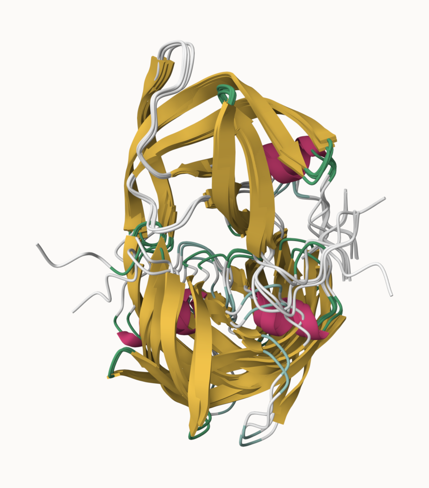
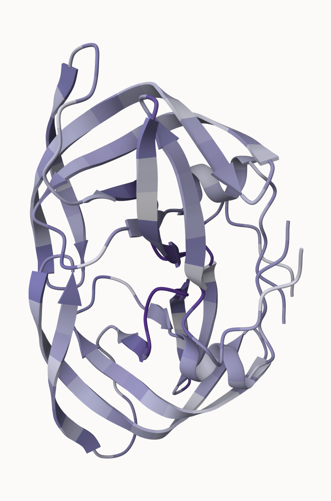

## Generating your own structure predictions

Figure of 5 generated HIV_PR models


Figure of sequence coverage


Figure of Predicted IDDT per position

 \## Visualization of the models and their estimated reliability

Fitted and pLDDT colored Nras structure models.


Coloring the Residue property of Secondary Structure



Coloring the Residue property of Hydrophobicity

 Coloring the Residue property of Accessible surface Area


## Custom analysis of resulting models in R

Now we read the results of the more complicated HIV-Pr dimer AlphaFold2 models into R using `Bio3D package`.

To move our AlphaFold results directory into our RStudio project directory...

```{r}

results_dir <- "hivprdimer_23119/" 

pdb_files <- list.files(path=results_dir,
                        pattern="*.pdb",
                        full.names = TRUE)

```

Print out our PDB file names

```{r}
basename(pdb_files)
```

```{r}
library(bio3d)

pdbs <- pdbaln(pdb_files, fit=TRUE, exefile="msa")
```

We can use the rmsd() function to calculate the RMSD between all pairs models.

```{r}
rd <- rmsd(pdbs, fit=T)

range(rd)
```

Draw a heatmap of these RMSD matrix values

```{r}
library(pheatmap)

colnames(rd) <- paste0("m",1:5)
rownames(rd) <- paste0("m",1:5)
pheatmap(rd)
```

Models 1 and 2 are most similar to each other, while 4 and 5 resemble each other and are closer to 3 than to 1 or 2.

```{r}
pdb <- read.pdb("1hsg")

plotb3(pdbs$b[1,], typ="l", lwd=2, sse=pdb)
points(pdbs$b[2,], typ="l", col="red")
points(pdbs$b[3,], typ="l", col="blue")
points(pdbs$b[4,], typ="l", col="darkgreen")
points(pdbs$b[5,], typ="l", col="orange")
abline(v=100, col="gray")
```

```{r}
core <- core.find(pdbs)
core.inds <- print(core, vol=0.5)
xyz <- pdbfit(pdbs, core.inds, outpath="corefit_structures")
```

We can also plot the pLDDT values across all models

```{r}
pdb <- read.pdb("1hsg")

plotb3(pdbs$b[1,], typ="l", lwd=2, sse=pdb)
points(pdbs$b[2,], typ="l", col="red")
points(pdbs$b[3,], typ="l", col="blue")
points(pdbs$b[4,], typ="l", col="darkgreen")
points(pdbs$b[5,], typ="l", col="orange")
abline(v=100, col="gray")
```

To enhance the alignment of our models, we can identify the most stable “rigid core” shared among them using the `core.find()` function:

```{r}
core <- core.find(pdbs)
```

The resulting core atom positions then serve as a reference for a refined superposition, after which we can save the fitted structures to `corefit_structures`:

```{r}
core.inds <- print(core, vol=0.5)
xyz <- pdbfit(pdbs, core.inds, outpath="corefit_structures")
```

The resulting superposed coordinates are written to a new director called `corefit_structures/`. We can now open these in Mol\* and color by the **Atom Property** of **Uncertainty/Disorder** 

/Users/chenr/Downloads/M1_CONSERV.PDB-2.png


Examine the RMSF between positions of the structure.

```{r}
rf <- rmsf(xyz)

plotb3(rf, sse=pdb)
abline(v=100, col="gray", ylab="RMSF")
```

## Predicted Alignment Error for domains

AlphaFold also provides a *Predicted Aligned Error (PAE)* output, stored in per-model JSON files. PAE measures the expected positional error between residues, independent of the 3D structure.

In R, we can read these files with jsonlite

```{r}
library(jsonlite)

pae_files <- list.files(path=results_dir,
                        pattern=".*model.*\\.json",
                        full.names = TRUE)
```

for example purposes lets read the 1st and 5th files (you can read the others and make similar plots).

```{r}
pae1 <- jsonlite::read_json(pae_files[1], simplifyVector = TRUE)
pae5 <- jsonlite::read_json(pae_files[5], simplifyVector = TRUE)
attributes(pae1)
```

```{r}
head(pae1$plddt) 
```

The maximum PAE values are useful for ranking models. Here we can see that model 5 is much worse than model 1. The lower the PAE score the better. How about the other models, what are thir max PAE scores?

```{r}
pae1$max_pae
pae5$max_pae 
```

We can plot the N by N (where N is the number of residues) PAE scores with ggplot or with functions from the Bio3D package:

```{r}
plot.dmat(pae1$pae, 
          xlab="Residue Position (i)",
          ylab="Residue Position (j)")

plot.dmat(pae5$pae, 
          xlab="Residue Position (i)",
          ylab="Residue Position (j)",
          grid.col = "black",
          zlim=c(0,30))
```

We should really plot all of these using the same z range. Here is the model 1 plot again but this time using the same data range as the plot for model 5:

```{r}
plot.dmat(pae1$pae, 
          xlab="Residue Position (i)",
          ylab="Residue Position (j)",
          grid.col = "black",
          zlim=c(0,30))
```

## Residue conservation from alignment file

```{r}
aln_file <- list.files(path=results_dir,
                       pattern=".a3m$",
                        full.names = TRUE)
aln_file
```

```{r}
aln <- read.fasta(aln_file[1], to.upper = TRUE)
```

How many sequences are in this alignment

```{r}
dim(aln$ali)
```

The alignment contains 5,397 sequences and 132 positions.

We can score residue conservation in the alignment with the `conserv()` function.

```{r}
sim <- conserv(aln)

plotb3(sim[1:99], sse=trim.pdb(pdb, chain="A"),
       ylab="Conservation Score")
```

Note the conserved Active Site residues D25, T26, G27, A28. These positions will stand out if we generate a consensus sequence with a high cutoff value:

```{r}
con <- consensus(aln, cutoff = 0.9)
con$seq
```

For a final visualization of these functionally important sites we can map this conservation score to the Occupancy column of a PDB file for viewing in molecular viewer programs such as Mol\*, PyMol, VMD, chimera etc.

```{r}
m1.pdb <- read.pdb(pdb_files[1])
occ <- vec2resno(c(sim[1:99], sim[1:99]), m1.pdb$atom$resno)
write.pdb(m1.pdb, o=occ, file="m1_conserv.pdb")
```

```{r}
getwd()
```

```{r}
list.files()
```


